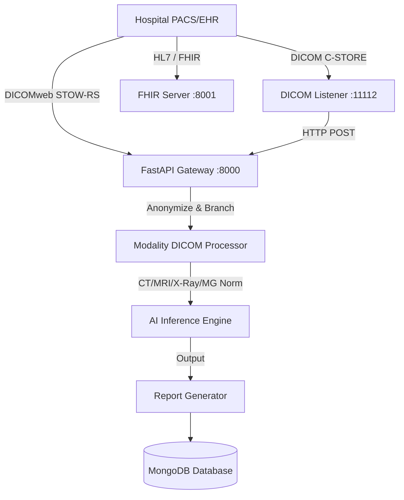

# Hospital Integration & Deployment Guide

## 1. System Architecture Overview
The Aviothic Medical AI Platform operates using a containerized microservice architecture suitable for on-premise hospital deployment or compliant cloud infrastructure.



## 2. Updated Modules
* `backend/app/services/dicom_handler.py`: Modality-aware PHI anonymizer & PyDicom extractor.
* `integration/dicom_listener.py`: PyNetDicom C-STORE Provider listening on port 11112.
* `integration/fhir_server.py`: FHIR REST interface serving on port 8001 for automated order/patient ingesting.
* `backend/app/routes/dicomweb.py`: STOW-RS/QIDO-RS Web capabilities.

## 3. Modality Awareness Features
The system reads the `Modality (0008,0060)` tag out-of-the-box and applies clinical enhancements:
* **CT**: Hounsfield Unit soft-tissue windowing (-150 to 250 HU mapped to 0-255 grayscale).
* **MRI (MR)**: Histogram intensity clipping (1st & 99th percentile) to reject artifact outliers.
* **Mammography (MG)**: Breast region cropping + Contrast adaptive enhancement.
* **X-Ray (CR/DX)**: MinMax Grayscale scaling.

## 4. Anonymization Protocol (HIPAA/GDPR)
Protected Health Info is immediately scrubbed *before* images reach the pipeline tensor matrix.
Fields dropped/replaced include: `PatientName`, `PatientID`, `PatientBirthDate`, `PatientSex`, `InstitutionName`, `ReferringPhysicianName`.

## 5. Deployment Instructions

Ensure the host machine allows inbound TCP traffic on ports **8000** (API), **8001** (FHIR), and **11112** (DICOM).

**1. Clone and Initialize:**
```bash
cd aviothic_ai_platform
docker-compose build
```

**2. Stand up the integration plane:**
```bash
docker-compose up -d
```

**3. Test DICOM Router:**
Use a DICOM client (e.g. `storescu` from dcmtk) to ping the listener:
```bash
storescu -v localhost 11112 my_test_image.dcm
```
You should see inference activity populated at `http://localhost:8000/api/docs`.

## 6. Security & Audit Logging
* Ensure you configure the `.env` `SECRET_KEY` variables.
* The API Gateway is fronted by Auth middleware requiring tokens for remote `multipart/form-data` uploads.
* For pure internal intranet deployment, ensure your docker-compose bridge network is restricted.
